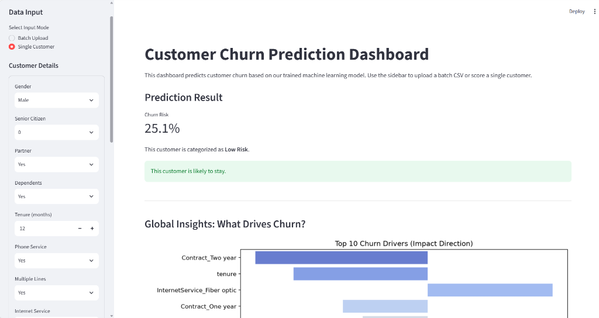
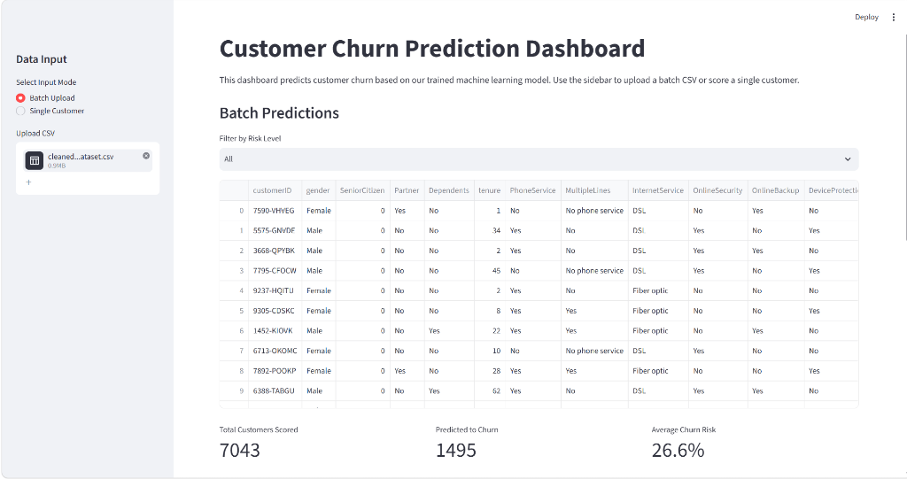
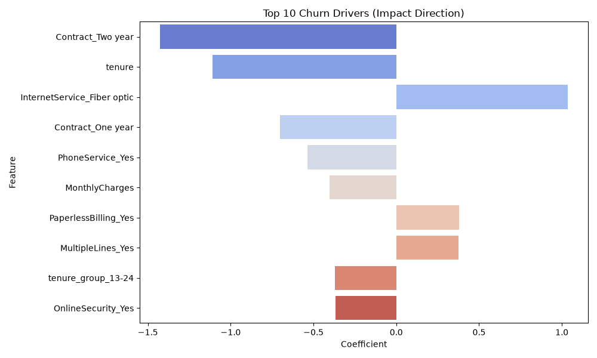
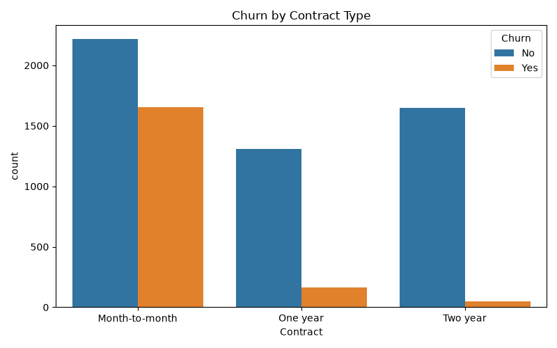
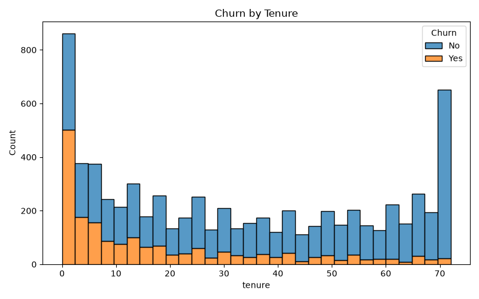
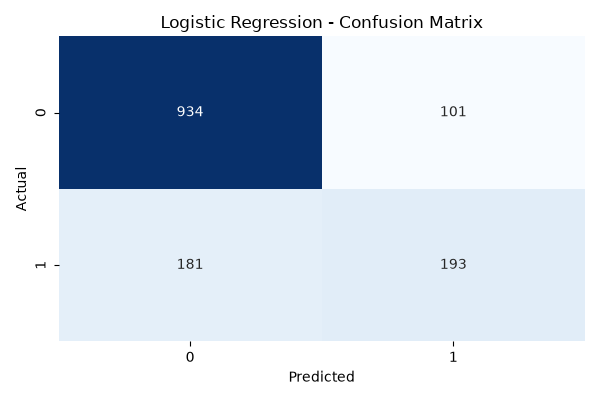
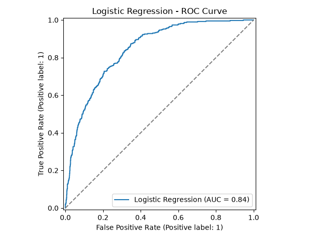

# Customer Churn Prediction Dashboard

This project is an end-to-end machine learning system that predicts customer churn. It takes historical customer data, cleans it, trains a classification model, and serves predictions through an interactive Streamlit dashboard. 

The goal is to provide non-technical stakeholders with an easy-to-use tool to identify high-risk customers and understand the key factors driving churn.

## Project Structure
- `data/`: Contains the original and cleaned CSV datasets.
- `notebooks/`: Contains generated exploratory data analysis (EDA) plots and model evaluation charts (Confusion Matrix, ROC Curve, Feature Importance).
- `src/`: Python scripts for the data pipeline:
  - `load_data.py`: Loads the raw data.
  - `eda.py`: Cleans the data and generates exploratory visualizations.
  - `feature_engineering.py`: Preprocesses data, handles encoding/scaling, and splits into train/test sets.
  - `train_models.py`: Trains Logistic Regression and XGBoost models, evaluates them, and exports the best one.
  - `interpret_model.py`: Extracts and visualizes the top factors driving churn.
- `app/`: Contains the Streamlit dashboard (`app.py`) and the exported machine learning models (`model.joblib`, `scaler.joblib`, `features.joblib`).

## Screenshots

### 1. Single Customer Prediction


### 2. Batch Scoring & Filtering


### 3. Key Churn Drivers


## CRISP-DM Methodology

This project follows the Cross-Industry Standard Process for Data Mining (CRISP-DM):

1. **Business Understanding**
   - Identified the need for early detection of customer churn
   - Defined objectives: create interpretable, highly accurate models for proactive retention

2. **Data Understanding**
   - Analyzed the Telco Customer Churn dataset (~7,000 records)
   - Evaluated 21 available variables (demographics, account info, services)
   - Explored class imbalance (roughly 27% churn rate)
   
   **Exploratory Data Analysis Highlights:**
   
   *Churn by Contract Type*
   
   
   *Churn by Tenure*
   

3. **Data Preparation**
   - Cleaned missing/blank values in `TotalCharges` by converting them to numeric
   - Engineered new features such as `tenure_group` and `avg_charge_per_month`
   - One-hot encoded categorical features and standardized numeric features
   - Performed stratified train-test splitting to preserve class distributions

4. **Modeling**
   - Implemented multiple modeling pipelines (Logistic Regression and XGBoost)
   - Addressed class imbalance through metric selection (ROC-AUC instead of raw accuracy)
   - Selected Logistic Regression as the final model due to superior performance and interpretability

5. **Evaluation**
   - Evaluated models using ROC-AUC, precision, recall, and F1-score
   - Analyzed feature importance through logistic coefficients
   - Validated final performance on a 20% held-out test set

6. **Deployment**
   - Developed a Streamlit application for interactive churn risk assessment
   - Built a dual-input UI for single-customer forms and batch CSV uploads
   - Created interpretable risk outputs (Low/Medium/High) and driver visualizations for non-technical users
## Modeling Approach

### Class-Imbalance Handling
* **Stratified Splitting:** Maintained the same proportion of churned vs. retained customers in both train and test sets to ensure representative evaluation.
* **Metric Selection:** Relied on Precision, Recall, F1-Score, and ROC-AUC rather than raw accuracy to account for the imbalanced nature of the churn dataset.

### Model Pipelines
* **Traditional Models:** Logistic Regression
* **Gradient Boosting:** XGBoost Classifier

### Evaluation Metrics
* Evaluated models primarily on ROC-AUC, Precision, and Recall on a 20% hold-out test set.

## Key Results

| Model | ROC-AUC | Precision | Recall | F1-Score |
|---|---|---|---|---|
| **Logistic Regression** | 0.843 | 0.657 | 0.516 | 0.578 |
| **XGBoost** | 0.822 | 0.597 | 0.500 | 0.544 |

### Model Comparison
* **Logistic Regression** offered the best performance across all metrics and provided excellent interpretability via feature coefficients.
* **XGBoost** showed decent performance but underperformed the linear baseline while decreasing interpretability.

### Model Evaluation Charts

**Confusion Matrix (Logistic Regression)**  


**ROC Curve (Logistic Regression)**  


## Requirements

* Python 3.10+
* pandas
* numpy
* scikit-learn
* xgboost
* streamlit
* matplotlib
* seaborn
* joblib

## Key Insights
Based on our Logistic Regression model, the top factors that influence whether a customer will churn are:
1. **Two-Year Contracts & Longer Tenure:** These strongly decrease the likelihood of a customer leaving.
2. **Fiber Optic Internet:** Customers on the Fiber Optic plan are noticeably more likely to churn, indicating a potential issue with pricing or service reliability in that specific tier.

## How to Run Locally

1. **Clone the repository**
2. **Create a virtual environment and install dependencies:**
   ```bash
   python -m venv venv
   source venv/bin/activate  # On Windows use: venv\Scripts\activate
   pip install -r requirements.txt
   ```
3. **Run the Streamlit Dashboard:**
   ```bash
   streamlit run app/app.py
   ```

## References

* IBM / Kaggle. "Telco Customer Churn". Kaggle. https://www.kaggle.com/datasets/blastchar/telco-customer-churn
* P. Chapman, J. Clinton, R. Kerber, T. Khabaza, T. Reinartz, C. Shearer, and R. Wirth. 2000. "CRISP-DM 1.0: Step-by-step data mining guide". SPSS Inc.
* F. Pedregosa et al. 2011. "Scikit-learn: Machine Learning in Python". JMLR 12, pp. 2825-2830.
